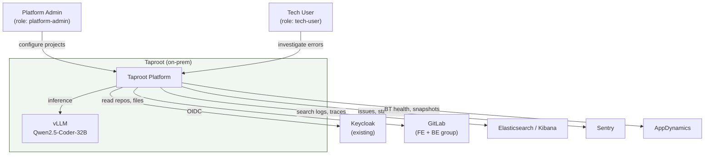
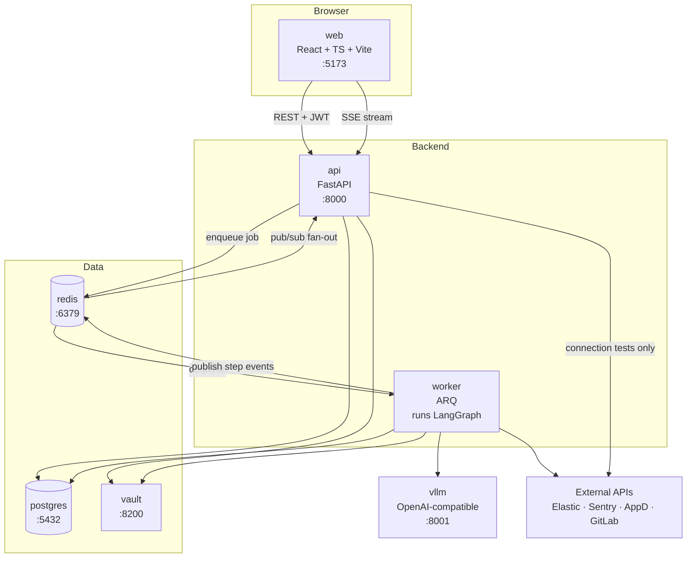
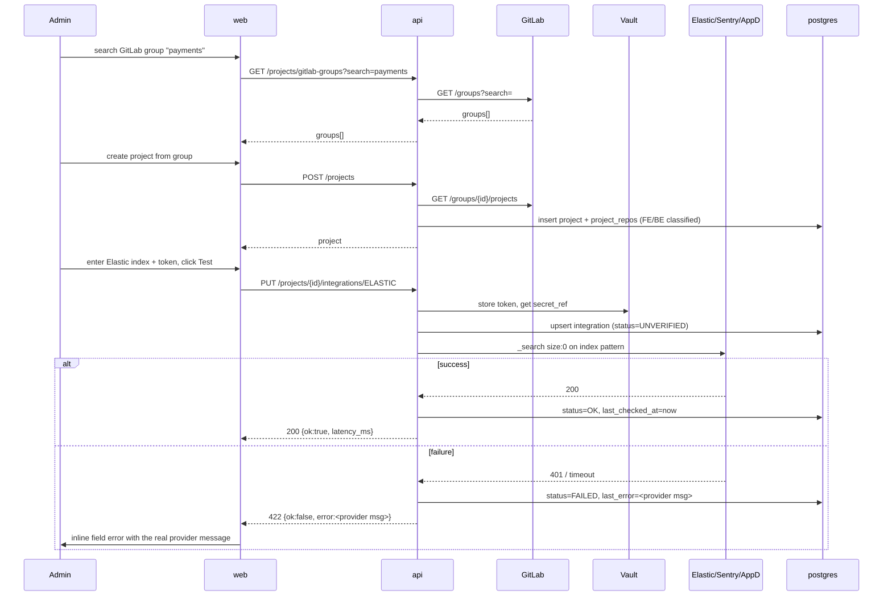
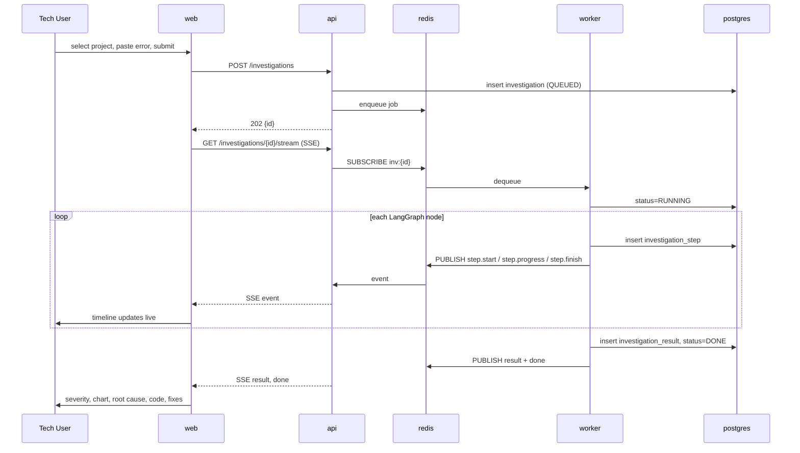
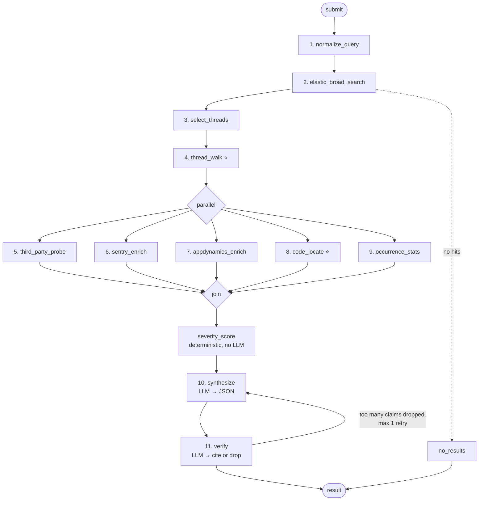
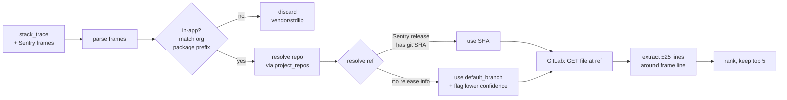
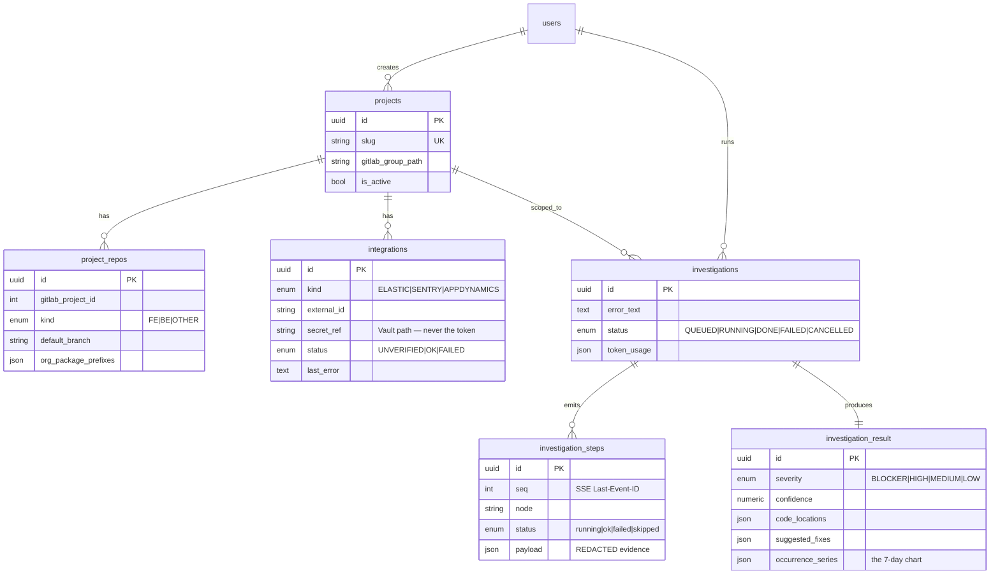
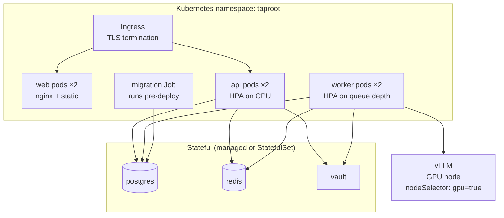

# Taproot — Architecture

> **Audience: the implementing AI agent.** This is the authoritative system design. When code and this document disagree, stop and raise it rather than silently diverging. When you make a design decision not covered here, record it as an ADR in `docs/adr/NNNN-title.md` and link it from the relevant section below.

**Companions:** `PLAN.md` (product spec + stack rationale) · `TASKS.md` (live task tracker)

---

## 1. System context



**Trust boundary:** everything inside `taproot` is on-prem. No user data, log content, or source code leaves the network — that is the entire reason for the local model. Any dependency that would require an outbound call at request time is a design error.

**Access posture:** Taproot holds **read-only** credentials to Elastic, Sentry, AppDynamics, and GitLab. It never writes to a monitored system. It proposes diffs; humans apply them.

---

## 2. Container view



### Container responsibilities

| Container | Owns | Must NOT |
|---|---|---|
| `web` | Rendering, auth redirect, SSE consumption, charts | Hold any secret; call external APIs directly |
| `api` | AuthN/Z, CRUD, validation, job enqueue, SSE relay | Run the agent; make long-running calls (>5s) |
| `worker` | The LangGraph agent, all external data gathering, LLM calls | Serve HTTP; be the only writer of `investigation_*` tables |
| `postgres` | Durable state, audit, step replay | — |
| `redis` | Job queue, SSE pub/sub, rate-limit counters, JWKS cache | Hold anything that must survive a restart |
| `vault` | Integration tokens | — |
| `vllm` | Inference | Have network egress |

**Why the split:** an investigation takes 30s–3min and fans out to four external systems. Doing that in a request handler blocks a worker thread and dies on any proxy timeout. The `api`/`worker` split is non-negotiable.

---

## 3. Backend module map & dependency rules

```
apps/api/src/taproot/
├── api/v1/          # HTTP layer — routers, request/response schemas
├── core/            # config, security, logging, redaction, exceptions
├── db/              # SQLAlchemy models, session, repositories
├── integrations/    # elastic.py sentry.py appdynamics.py gitlab.py keycloak.py llm.py
├── services/        # business logic: ProjectService, IntegrationService, InvestigationService
├── agent/           # graph.py state.py nodes/ tools/ prompts/ schemas.py scoring.py
└── workers/         # ARQ task definitions
```

**Dependency direction — enforce with `import-linter`, fail CI on violation:**

```
api/v1  →  services  →  { db, integrations, agent }
agent   →  { integrations, core }
integrations → core
db      → core
core    → (nothing internal)
```

Forbidden: `integrations` importing `services`; `agent` importing `api`; `db` importing anything but `core`. If you need the reverse direction, you need an interface in `core`, not an import.

**Integration client contract.** Every file in `integrations/` exposes a class with:
- an async constructor taking resolved config + a secret handle (never a raw token from the caller),
- `async def test_connection() -> ConnectionTestResult`,
- read-only methods returning **normalized domain models** from `core/models.py`, never raw provider JSON,
- a 30s timeout, 3 retries with jittered backoff on 5xx/429 only, and structured logging of `{provider, method, latency_ms, status}`.

Normalizing at the boundary is what lets the agent reason over Sentry and AppDynamics with the same code paths.

---

## 4. Frontend structure

```
apps/web/src/
├── features/
│   ├── auth/          # oidc-client-ts wiring, ProtectedRoute, useRole()
│   ├── admin/         # project creation, GitLab group picker, integration forms
│   ├── investigate/   # submit form, live step timeline, results view
│   └── history/       # past investigations
├── components/ui/     # shadcn primitives — do not hand-edit generated files
├── lib/
│   ├── api-client.ts  # generated from OpenAPI + auth interceptor
│   ├── sse.ts         # EventSource wrapper: reconnect, Last-Event-ID, typed events
│   └── keycloak.ts
└── types/generated/   # OpenAPI → TS. Regenerate, never hand-edit.
```

**Rules:**
- No `fetch` outside `lib/api-client.ts`.
- No type in `types/generated/` is edited by hand; if a type is wrong, fix the backend schema and regenerate.
- Server state lives in TanStack Query, UI state in component state. No Redux.
- The step timeline is driven **only** by SSE events, never by polling — but it must reconcile against `GET /investigations/{id}` on mount so a refresh mid-run restores correctly.

---

## 5. Key flows

### 5.1 Admin sets up a project (requirements 1, 2, 4, 5)



**Gate:** a project cannot run investigations unless its `ELASTIC` integration is `OK`. Sentry and AppDynamics failing degrades gracefully — those nodes report `skipped` with a visible reason.

### 5.2 Running an investigation (requirements 6–12)



**Reconnect:** on `EventSource` error, the browser retries with `Last-Event-ID`. `api` replays persisted `investigation_steps` with `seq > last_id`, then resumes the live subscription. This is why every step is written to Postgres *before* it is published to Redis — DB first, always.

---

## 6. The agent

### 6.1 Graph



### 6.2 State object

`agent/state.py` — a single Pydantic model threaded through every node. Nodes are pure-ish: they read state, call integrations, and return a **partial** state update. Never mutate in place.

```python
class InvestigationState(BaseModel):
    # inputs (immutable)
    investigation_id: UUID
    project_id: UUID
    error_text: str
    time_window_days: int = 7

    # node 1
    signals: QuerySignals | None = None          # exception class, tokens, service hint

    # nodes 2-4
    broad_hits: list[LogDoc] = []
    candidate_txn_ids: list[str] = []
    threads: list[LogThread] = []                # the deep dive output

    # nodes 5-9 (parallel — each writes only its own field)
    third_party: ThirdPartyFinding | None = None
    sentry: SentryFinding | None = None
    appdynamics: AppDFinding | None = None
    code_locations: list[CodeLocation] = []
    stats: OccurrenceStats | None = None

    # scoring + synthesis
    severity_score: SeverityScore | None = None
    result: InvestigationResult | None = None

    # bookkeeping
    node_errors: dict[str, str] = {}             # node -> message; does NOT fail the run
    tokens_used: int = 0
```

**Parallel-node rule:** nodes 5–9 must write to disjoint fields. LangGraph merges concurrent updates; overlapping writes are a race. If two nodes need the same field, they don't — one of them needs a new field.

### 6.3 Node contract

Every node:
1. emits `step.start` with a human-readable title before doing anything,
2. wraps its body in a per-node timeout (`AGENT_NODE_TIMEOUT_S`, default 45),
3. on exception: records to `state.node_errors`, emits `step.finish{status:"failed"}`, **returns normally** — one dead node does not kill the investigation,
4. when its integration is unconfigured: emits `step.finish{status:"skipped", summary:"<why>"}` and returns,
5. emits `step.finish{status:"ok", summary, metrics}` on success.

The only nodes whose failure aborts the run are `elastic_broad_search` (no data = nothing to reason about) and `synthesize` (no output).

### 6.4 `thread_walk` — the deep dive (requirement 10)

This is the node that differentiates Taproot from a Kibana search box.

```
for txn_id in selected (top 3-5):
    docs = elastic.thread(txn_id)      # ALL severities, @timestamp ASC, size 500
    thread = LogThread(
        txn_id, docs,
        error_index   = first index where severity in (ERROR, FATAL),
        preamble      = docs[:error_index],     # ← the actual trigger usually lives here
        aftermath     = docs[error_index:],     # retries, cascading failures, rollbacks
        services      = distinct(doc.service),  # where the request crossed boundaries
        user_hash     = hash(user_name),
    )
```

The insight the agent must exploit: **the error line tells you the symptom; the INFO lines immediately before it tell you the cause.** A `NullPointerException` is meaningless; the `INFO: partner-api returned 200 with empty body` three lines earlier is the answer. Summarize each thread to ≤400 tokens before it enters the synthesis prompt — never dump 500 raw lines into the LLM.

### 6.5 `code_locate` — from stack trace to source (requirement 12.4)



Failure modes to handle explicitly: file not found at ref (fall back to default branch, lower confidence), minified/bundled FE frames (skip unless a source map is available — Phase 2), monorepo path prefixes that don't match the repo root, and frames from a repo not registered in `project_repos` (report the path, no snippet).

`ORG_PACKAGE_PREFIXES` is per-project config (e.g. `com.acme.`, `src/`, `apps/`). Without it this node returns noise.

### 6.6 Severity (requirement 12.2) — deterministic first

Scoring runs in **plain Python before the LLM sees anything** (`agent/scoring.py`, rubric in `PLAN.md` §6.4). The LLM may adjust by at most one level and must supply a written reason, which is stored. This keeps severity auditable and reproducible — two runs on the same incident must not disagree.

### 6.7 LLM boundary rules

- **Exactly two LLM calls per investigation** on the happy path: `synthesize` and `verify`. (`normalize_query` uses a small structured call; keep it cheap.) If you find yourself adding a third, ask whether it's really a code problem.
- Every prompt is a versioned file in `agent/prompts/*.jinja2`. Prompts are code: reviewed, diffed, never built by string concatenation in a node.
- Every prompt passes through `core/redaction.py` first. **No exceptions.** A test asserts that `FakeLLM` never receives a raw username, email, token, or secret-shaped string.
- Output is Pydantic-validated with a 2-retry repair loop. On third failure the investigation fails loudly. **Never fabricate a result.**
- Token budget enforced per investigation (`TAPROOT_AGENT_MAX_TOKENS`, default 120k); exceeding it truncates evidence oldest-first and records the truncation in `open_questions`.

---

## 7. Data model



Full column list in `PLAN.md` §4.

**Sensitivity:** `investigation_steps.payload` contains log excerpts. Treat it as production data — encrypted at rest, purged after `TAPROOT_INVESTIGATION_RETENTION_DAYS` (default 90), never exported without redaction.

---

## 8. Cross-cutting concerns

### 8.1 Authentication & authorization

```
Browser --(Auth Code + PKCE)--> Keycloak --(id+access token)--> Browser
Browser --(Bearer access token)--> api --(validate vs cached JWKS)--> allow/deny
```

- FE is a **public** client. No client secret in the browser, ever.
- `api` validates signature, `iss`, `aud`, `exp`, and required realm role. JWKS cached in Redis, 1h TTL, refreshed on unknown `kid`.
- Roles come from the token (`realm_access.roles`), never from the DB. The DB stores only a user record for audit joins.
- **SSE authorization is per-investigation**, not just per-role: the caller must own the investigation or be an admin. This is the easiest endpoint to leave open by accident.
- 401 = bad/expired token (FE re-auths silently). 403 = valid token, wrong role (FE shows a message). Never conflate them.

### 8.2 Secrets

Integration tokens go to Vault; Postgres stores only a `secret_ref`. Tokens are **never** returned by any API response, never logged, never placed in a step payload, and never sent to the LLM. The integration UI shows `••••••••` with a "replace" action, never the value.

Local dev falls back to `LocalEncryptedSecretStore` (envelope encryption with a dev key). It is a dev-only implementation and must refuse to start when `TAPROOT_ENV=production`.

### 8.3 Redaction pipeline

`core/redaction.py` runs on everything crossing into an LLM prompt *or* into a persisted step payload:

| Pattern | Action |
|---|---|
| `user_name` field | replace with `user_<sha256[:8]>` |
| email addresses | mask local part |
| `Bearer <token>`, `api_key=`, JWT shapes | replace with `<REDACTED_TOKEN>` |
| credit card / national ID patterns | `<REDACTED_PII>` |
| known secret prefixes (`glpat-`, `sntrys_`, `AKIA`) | `<REDACTED_SECRET>` |

The local model reduces the blast radius but does not remove the obligation. Redact anyway.

### 8.4 Error handling

| Failure | Behaviour |
|---|---|
| One agent node fails | Recorded, step shown red, investigation continues with partial evidence |
| Elastic unavailable | Investigation fails fast with a clear message; no LLM call is made |
| Sentry / AppD unavailable | Node `skipped`, reason surfaced in the UI, confidence reduced |
| LLM invalid JSON ×3 | Investigation `FAILED`, raw output stored for debugging |
| Investigation exceeds 5 min | Cancelled, partial result returned with `open_questions` populated |
| Worker crashes mid-run | Job retried once; on second failure marked `FAILED` (never silently requeued forever) |

Errors surfaced to users are actionable and name the system that failed. `"Something went wrong"` is a bug.

### 8.5 Observability

OpenTelemetry throughout, exported to the customer's own Elastic — Taproot dogfoods the thing it monitors. One trace spans `api` → `redis` → `worker` → every node → every external call. Log a JSON line per node with `{investigation_id, node, duration_ms, docs_fetched, tokens}`.

Metrics that matter: investigation duration p50/p95, node failure rate by node, LLM tokens per investigation, external API latency by provider, GPU queue depth.

### 8.6 Performance targets

| Metric | Target |
|---|---|
| Time to first step event | < 2s |
| Investigation p50 | < 60s |
| Investigation p95 | < 180s |
| Concurrent investigations | 5 (GPU-bound — enforce with a semaphore) |
| API p95 (non-investigation) | < 300ms |

The GPU is the bottleneck. Queue depth, not CPU, is the scaling signal.

---

## 9. Deployment



- Migrations run as a pre-install/pre-upgrade Helm hook. Every migration must be backward-compatible with the previous app version (expand/contract), so a rollback doesn't corrupt data.
- `api` readiness = DB + Redis reachable. `worker` readiness = Redis + LLM reachable.
- SSE requires the ingress to disable response buffering (`nginx.ingress.kubernetes.io/proxy-buffering: "off"`) and a read timeout ≥ 6 min. **This is the single most common cause of "the steps don't stream" — check it first.**
- Dev is `docker-compose` with Ollama in place of vLLM.

---

## 10. Environment variables

```bash
# Core
TAPROOT_ENV=development|staging|production
TAPROOT_DATABASE_URL=postgresql+asyncpg://...
TAPROOT_REDIS_URL=redis://...
TAPROOT_LOG_LEVEL=INFO

# Auth
TAPROOT_KEYCLOAK_URL=https://keycloak.internal
TAPROOT_KEYCLOAK_REALM=
TAPROOT_KEYCLOAK_AUDIENCE=taproot-api
VITE_KEYCLOAK_CLIENT_ID=taproot-web

# Secrets
TAPROOT_SECRET_STORE=vault|local
TAPROOT_VAULT_ADDR=
TAPROOT_VAULT_TOKEN=

# LLM
TAPROOT_LLM_BASE_URL=http://vllm:8001/v1
TAPROOT_LLM_MODEL=Qwen2.5-Coder-32B-Instruct
TAPROOT_LLM_TIMEOUT_S=120

# GitLab (platform-level, for group discovery)
TAPROOT_GITLAB_URL=https://gitlab.internal
TAPROOT_GITLAB_TOKEN=          # read_api scope ONLY

# Agent tuning
TAPROOT_AGENT_MAX_TOKENS=120000
TAPROOT_AGENT_NODE_TIMEOUT_S=45
TAPROOT_AGENT_MAX_DURATION_S=300
TAPROOT_AGENT_MAX_THREADS=5
TAPROOT_AGENT_CONCURRENCY=5

# Retention
TAPROOT_INVESTIGATION_RETENTION_DAYS=90
```

Keep `.env.example` byte-for-byte in sync with this list. A missing var must fail at startup with a named error, never at first use.

---

## 11. Conventions

- **Python:** 3.12, `ruff` + `mypy --strict`, async-first, `snake_case`, Pydantic for every boundary. No bare `except`.
- **TypeScript:** strict mode, no `any`, `PascalCase` components, `camelCase` everything else.
- **Commits:** Conventional Commits, scoped to the task — `feat(agent): add thread_walk node [T-21]`.
- **Branches:** `feat/T-21-thread-walk`, one task per branch, one MR per branch.
- **Tests:** unit tests colocated by module; integration tests use recorded fixtures; agent eval suite runs nightly. New node = new fixture test, no exceptions.
- **ADRs:** any decision that would surprise a future reader goes in `docs/adr/`.

---

## 12. Assumptions that must be validated before Sprint 2

These are load-bearing. If any is false, the design changes.

| # | Assumption | Breaks if false |
|---|---|---|
| 1 | ELK docs have `@timestamp` | Chart + thread ordering + all time filtering |
| 2 | ELK docs have a service/application field | Cross-service correlation, `code_locate` repo resolution |
| 3 | `transaction_id` propagates across service boundaries | `thread_walk` sees only one service — the deep dive collapses |
| 4 | Sentry releases are tagged with git SHAs | `code_locate` falls back to default branch, accuracy drops materially |
| 5 | AppDynamics has OAuth API-client credentials | Node 7 needs a different auth path |
| 6 | A 32B-class GPU is available | Model choice and latency targets both change |

Open these as questions before writing code against them.
